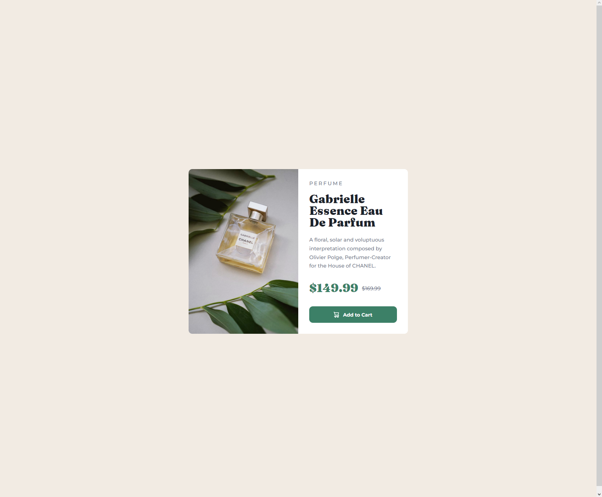

# Frontend Mentor - Product preview card component solution

This is a solution to the [Product preview card component challenge on Frontend Mentor](https://www.frontendmentor.io/challenges/product-preview-card-component-GO7UmttRfa). Frontend Mentor challenges help you improve your coding skills by building realistic projects. 

## Table of contents

- [Overview](#overview)
  - [The challenge](#the-challenge)
  - [Screenshot](#screenshot)
  - [Links](#links)
- [My process](#my-process)
  - [Built with](#built-with)
  - [What I learned](#what-i-learned)
  - [Continued development](#continued-development)
  - [Useful resources](#useful-resources)
- [Author](#author)

## Overview

### The challenge

Users should be able to:

- View the optimal layout depending on their device's screen size
- See hover and focus states for interactive elements

### Screenshot



### Links

- Solution URL: [Solution](https://github.com/JustANipple/product-preview-card-component/blob/master/index.html)
- Live Site URL: [Live site](https://justanipple.github.io/product-preview-card-component/)

## My process

### Built with

- Semantic HTML5 markup
- CSS custom properties
- Flexbox
- Media query
- Aspect ratio

### What I learned

I learned to use aspect ratio to mantain the right dimension of the box.
It would be better implementing the mobile version of the site first to avoid creating big media queries

```css
    @media screen and (max-width: 600px) {
      .image {
        background-image: url(images/image-product-mobile.jpg);
        background-repeat: no-repeat;
        border-radius: 10px 10px 0 0;
      }

      main {
        flex-direction: column;
        height: 650px;
        width: 345px;
      }

      .box {
        border-radius: 10px 10px 0 0;
      }

      .box .innerbox {
        padding: 25px;
      }
    }
```

### Continued development

I'm not quite sure i'm using images the right way. I'm trying to adapt the box based on the image, but it shouldn't be this way.
Next time i'll focus more on auto resizing images based on the box they're contained

### Useful resources

- [Aspect ratio](https://developer.mozilla.org/en-US/docs/Web/CSS/aspect-ratio) - This helped me to give the box a size.
- [Color picker](https://imagecolorpicker.com) - I didn't know the color of the active part of the button. With Color picker i uploaded the design image and caught the color of the button

## Author

- Frontend Mentor - [@JustANipple](https://www.frontendmentor.io/profile/JustANipple)
